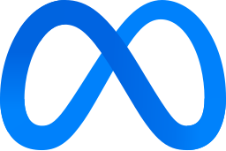
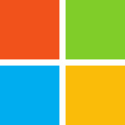
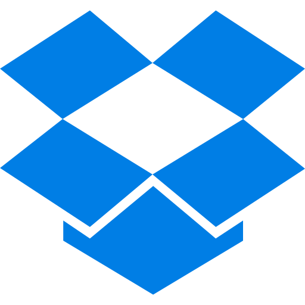

# Curso de Rust 

Dictado por: Pildoras Informáticas, Youtuber

## ¿Qué es Rust?

- Es un lenguaje de programación creado por Mozilla y actualmente mantenido por Rust Foundation.

## ¿Para qué sirve Rust?

- Para crear aplicaciones rápidas y seguras donde la estabilidad y rendimiento son críticos.

  **Ejemplos de aplicaciones que se crean con Rust:**

  - Sistemas operativos, servidores web, herramientas de consola, sistemas embebidos, microservicios, motores de videojuegos, herramientas criptográficas y de seguridad, servicios en la nube, drivers, apps WebAssembly, etc.

### Diferencias entre Rust y C++

**Objetivos comunes:**

- Programación de alto rendimiento cercana al hardware
- Control total de memoria (sin garbage collector)

- Desarrollo de sistemas (S.O., drivers, motores gráficos, etc.)
- Concurrencia bajo nivel optimizada

**Diferencias:**

- C++ te da libertad total. Rust te "acompaña" mas
- C++ confía en el programador. Rust confia en el compilador y en las reglas de propiedad (ownership)

- En C++ puedes crear data races. Rust no compila data race

## Empresas que usan Rust

   Huawei
   Canonical
   OpenAI
   Meta
   Microsoft
   AWS
   Google
   Cloudflare
   Dropbox

## Tipos en Rust

**Escaleras:**

- Representan un único valor simple
- Enteros
  - I8, u8, u16, I32, u32, i64, i128, u128, isize, usize
- Decimales (flotantes)
  - f32, f64
- Booleanos
  - bool
- Caracteres
  - char

**Compuestos:**

- Tuplas
- Arrays
